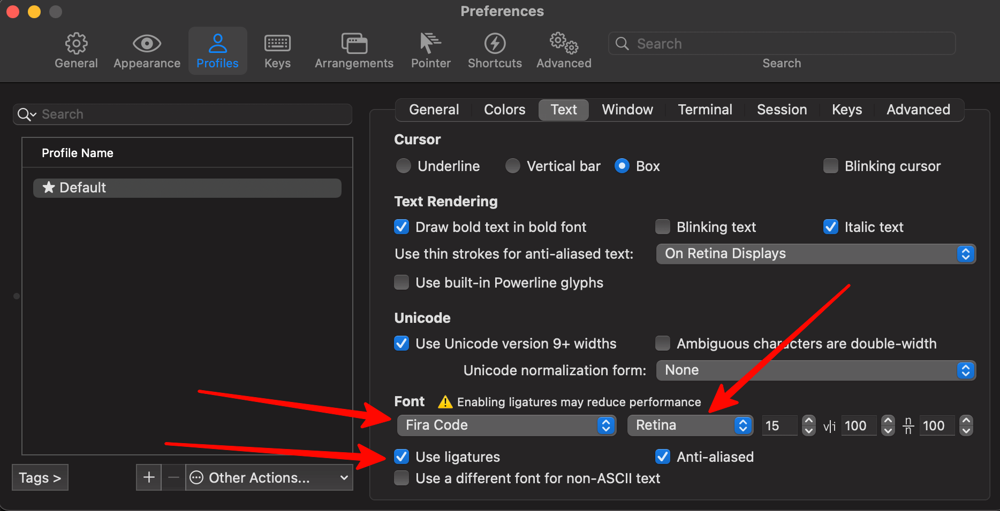

# Fresh macbook bootstrap
You got new macbook and you are web developer with python backend and/or typescript frontend? This instruction will help you to prepare macbook for work.

  - [Basic setup](#basic-setup)
  - [Python part](#python-part)
  - [VSCode configuration](#vscode-configuration)

## Basic setup
1. Setup o my zsh
    ```bash
    sh -c "$(curl -fsSL https://raw.github.com/ohmyzsh/ohmyzsh/master/tools/install.sh)"
    ```
1. Generate ssh key:
    ```bash
    ssh-keygen -o -a 100 -t ed25519 -C "ad@xfenix.ru"
    ```
    Copy you key in the clipboard:
    ```
    cat ~/.ssh/id_ed25519.pub | pbcopy
    ```
1. Install FiraCode font: https://github.com/tonsky/FiraCode
1. Install chrome: https://www.google.com/chrome/
1. Reccomended extensions:
   1. https://chrome.google.com/webstore/detail/ublock-origin/cjpalhdlnbpafiamejdnhcphjbkeiagm?hl=en
   1. https://chrome.google.com/webstore/detail/tab-suspender/fiabciakcmgepblmdkmemdbbkilneeeh?hl=en
   1. Also for Russian users: https://chrome.google.com/webstore/detail/%D0%BE%D0%B1%D1%85%D0%BE%D0%B4-%D0%B1%D0%BB%D0%BE%D0%BA%D0%B8%D1%80%D0%BE%D0%B2%D0%BE%D0%BA-%D1%80%D1%83%D0%BD%D0%B5%D1%82%D0%B0/npgcnondjocldhldegnakemclmfkngch?hl=ru
1. Install homebrew:
    ```bash
    /bin/bash -c "$(curl -fsSL https://raw.githubusercontent.com/Homebrew/install/HEAD/install.sh)"
    ```
1. Install all necessary packages:
    ```bash
    brew install stats itsycal git iterm2 visual-studio-code pyenv gpg-suite grammarly marta node dozer appcleaner keyboardcleantool karabiner-elements
    ```
    1. <a href="https://github.com/Mortennn/Dozer" target="_blank">Dozer</a> help you to organize your menu bar, since macbook notch gain troubles in this area
    1. Grammarly is the best app for good english writing skills, those whom i lack
    1. <a href="https://marta.sh" target="_blank">Marta</a> is the sublime-like completely free file manager
    1. AppCleaner help you clean garbage after application removal
    1. <a href="https://folivora.ai/keyboardcleantool">KeyboardCleanTool</a> helps you to clean you keyboard! Very useful app for every developer
    1. (Optional) Karabiner elements will be useful for remapping keys on the Russian keyboard layout. This really helps for ~ symbol return. On other keyboard layouts it not so useful by default
1. Configure Iterm2:
   1. It helps not to disturb you 
   1. Best font 
   1. Good looking + Guake/Quake like behavior 
1. For macbook with Apple chip (M1, M1 pro, M1 max) install Rosetta2: 
    ```
    softwareupdate --install-rosetta
    ```
1. Install docker dekstop: https://www.docker.com/products/docker-desktop
1. Setup git client:
   1. Generate GPG key in GPG tools
   1. Run command:
        ```bash
        gpg --list-secret-keys
        ```
        Then copy following key:
        
   1. Setup:  
        ```bash
        git config --global user.name "Denis Anikin"
        git config --global user.email ad@xfenix.ru
        git config --global user.signingkey KEY_FROM_PREVIOUS_STEP
        git config --global commit.gpgsign true
        ```
1. File things:
   1. Create projects dir `mkdir ~/web/`
   1. Exclude from spotlight indexing (greatly reduce CPU pressure):  -> Settings -> Spotlight -> Privacy, press +, then `⌘ + shift + g` and enter following paths:
      1. `~/web/`
      1. `/Users/xfenix/Library/Containers`, where `xfenix` — you current user

## Python part
1. Setup pyenv
    ```bash
    echo 'eval "$(pyenv init --path)"' >> ~/.zprofile
    ```
    ```bash
    echo 'eval "$(pyenv init -)"' >> ~/.zshrc
    ```
1. Install and select desired python
   ```bash
   pyenv install 3.10.1
   ```
   ```bash
   pyenv global 3.10.1
   ```
1. Install all necessary packages
    ```bash
    pip install black isort docformatter pybetter autoflake
    ```

## VSCode configuration
This config meant for python development. But you can grab any part of it for other purposes.<br>
1. Install extensions:
    ```bash
    code --install-extension wk-j.save-and-run
    code --install-extension esbenp.prettier-vscode
    code --install-extension GitHub.github-vscode-theme
    code --install-extension helgardrichard.helium-icon-theme
    code --install-extension mde.select-highlight-minimap
    code --install-extension miguelsolorio.fluent-icons
    code --install-extension ms-python.python
    code --install-extension ms-python.vscode-pylance
    code --install-extension yzhang.markdown-all-in-one
    ```
1. Place following in you `settings.json`:
    ```json
    {
        "workbench.colorTheme": "GitHub Dark",
        "workbench.iconTheme": "helium-icon-theme",
        "workbench.productIconTheme": "fluent-icons",

        "markdown.preview.typographer": true,
        "markdown.extension.orderedList.marker": "one",

        "editor.wordBasedSuggestions": false,
        "editor.fontFamily": "FiraCode-Retina",
        "editor.fontSize": 14,
        "editor.fontLigatures": true,
        "editor.formatOnPaste": true,
        "editor.formatOnType": true,
        "editor.formatOnSave": true,
        "editor.renderWhitespace": "all",
        "editor.rulers": [
            120
        ],

        "debug.console.fontSize": 14,

        "terminal.integrated.fontSize": 14,

        "emmet.triggerExpansionOnTab": true,
        "emmet.includeLanguages": {
            "plaintext": "html"
        },

        "python.defaultInterpreterPath": "/Users/xfenix/.pyenv/shims/python",
        "python.linting.mypyPath": "/Users/xfenix/.pyenv/shims/mypy",
        "python.linting.mypyEnabled": true,
        "python.formatting.blackPath": "/Users/xfenix/.pyenv/shims/black",
        "python.formatting.provider": "black",
        "python.sortImports.path": "/Users/xfenix/.pyenv/shims/isort",
        // please, be prepared: this options will override any options in your isort.cfg, pyproject.toml
        // and etc. So — if you want to customize, comments this options
        "python.sortImports.args": [
            "--line-width",
            "120",
            "--lines-after-imports",
            "2",
            "--no-lines-before",
            "STDLIB,LOCALFOLDER"
        ],
        "[python]": {
            "editor.codeActionsOnSave": {
                "source.organizeImports": true
            }
        },
        "saveAndRun": {
            "commands": [
                {
                    "match": ".py",
                    "cmd": "/Users/xfenix/.pyenv/shims/docformatter --in-place ${file}",
                    "silent": true,
                },
                {
                    "match": ".py",
                    "cmd": "/Users/xfenix/.pyenv/shims/pybetter ${file} --exclude=B004",
                    "silent": true,
                },
                {
                    "match": ".py",
                    "cmd": "/Users/xfenix/.pyenv/shims/autoflake --in-place --remove-all-unused-imports --remove-unused-variables --ignore-init-module-imports --remove-duplicate-keys ${file}",
                    "silent": true,
                },
            ]
        },
    }
    ```
1. Dont forget to replace `xfenix` with you user!
